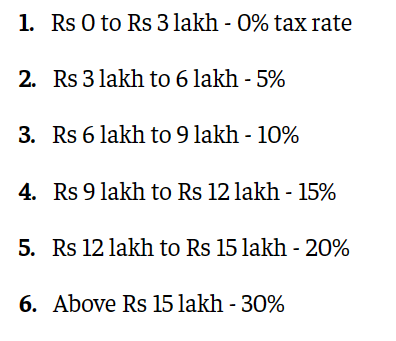

# Tax Collection Application – Spring Boot with IoC

## Problem statement

Suppose you are working on a government Tax collection application where users can pay Income and Property taxes. You are assigned to create the application using Spring Boot and the concept of Inversion of Control.

In the application, the user can choose the type of tax (Income/Property) and enter the taxable amount. The application will calculate the tax amount using the rules below. The income or Property tax can only be paid once.

### Tax Calculation rules:

1. **Income tax**: It will be calculated according to the government guidelines.

   Reference image

2. **Property Tax**: This tax will be 5% of the property value.

---

## Tasks:

1. Complete the `IncomeTax` and `PropertyTax` classes by adding the following attributes:
    - `taxableAmount (double)`: This attribute tells about the amount on which tax has to be applied, i.e. the taxable amount.
    - `taxAmount (double)`: This attribute tells about the final amount the user has to pay as Tax based on the calculation set by the government.
    - `isTaxPayed (false by default)`: This attribute tells about whether the user has paid the tax or not. If FALSE, then only the user should be taxed.

2. Make the `IncomeTax` and `PropertyTax` classes implement the `Tax` interface and override the interface methods.

3. The `Tax` interface has the following methods:
    - `void setTaxableAmount(double amount)`: This method sets the taxable amount.
    - `void calculateTaxAmount()`: This method calculates the tax amount using the taxable amount and rules given above and saves it in the `taxAmount` variable.
    - `double getTaxAmount()`: This method returns the tax amount.
    - `String getTaxType()`: This method returns the `taxType`, i.e. `"income"` or `"property"`.
    - `boolean isTaxPayed()`: This method returns the `isTaxPayed` attribute.
    - `void payTax()`: This method prints the tax payment confirmation statement and sets the `isTaxPayed` boolean TRUE.
        - **For Example**: `Hi, your property tax is paid.`

4. In the `applicationContext.xml` file (located in `src/main/resources`), create beans of `IncomeTax` and `PropertyTax` classes using the camel casing naming convention.

5. In the main application, call the context by taking the `ClassPathXMLApplicationContext` from the `applicationContext.xml` file.

---

## Special Instructions for submitting the solution:

1. Remove the `target` folder from the root directory of your project.

2. Remove the `test` folder from your `src` folder.

---

### Note:

1. Don't change the versions of Spring Boot (`3.0.0`) and Java (`17`). If needed then install the same.

2. Do not move the `ApplicationContext` file.

3. Bean ID should be the same as the class name but in **camel-case** version (refer to `ApplicationContext` file).

4. Do not modify the template code as it may produce inaccurate results. Keeping the original code intact is crucial to ensure correct output.
