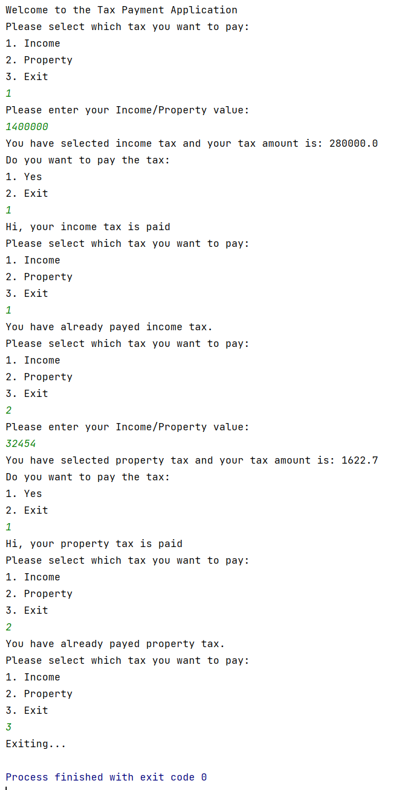

# 💰 Tax Application – Final Step: User Tax Input and Payment Flow

## Problem statement

Continuing the tax application, now you must take the income/property value from the console and calculate the tax amount, print the amount and give the user the choice to pay the tax. The tax can only be paid once.

---

## ✅ Tasks

1. Go to the `TaxApplication` class & perform the following steps in order to complete the tax application.

2. Check if the user has paid the tax already, if yes then print the below message on console:

   > "You have already paid Income/Property (get this from `getTaxType()` interface method) tax."

3. If the user has not paid tax then do the following:

    - Take the input of income/property value from the user based on the choice made & set this amount using `setTaxableAmount()` interface method.

    - Finally, calculate the `taxAmount` using `calculateTaxAmount()` interface method & ask user if he wants to pay the tax. If yes, then call `payTax()` method.

---

## 📁 Special Instructions for submitting the solution

1. Remove the `target` folder from the root directory of your project.

2. Remove the `"test"` folder from your `"src"` folder.

---

## ⚠️ Note

1. Don't change the versions of Spring Boot (`3.0.0`) and Java (`17`). If needed, then install the same.

2. Do not move the `"ApplicationContext"` file.

3. Bean ID should be the same as the class name but in **camel-case** version (refer to `ApplicationContext` file).

4. Do not modify the template code as it may produce inaccurate results. Keeping the original code intact is crucial to ensure correct output.

---

## 🖥️ Sample output

