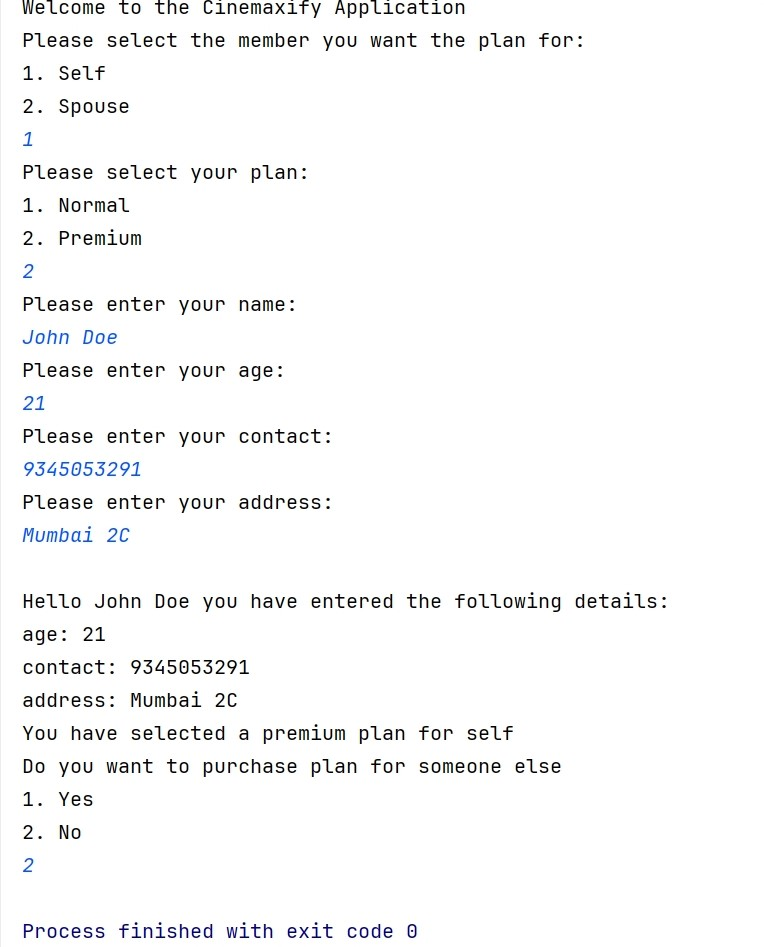

# Problem Statement

In continuation to the Cinemaxify application, now you have to take the user’s choice for plan selection, set them and print the details along with the user plan selection for the specific member.

A new interface, "Plan", along with its implementations, "NormalPlan" and "PremiumPlan", has been introduced to enable the selection of subscription plans for specific user types in the application.

---

## Tasks:-

1. The Plan interface features a single method, `getPlanName()`, which retrieves the plan name.

2. Implement the Plan interface and override the getPlanName() method in the below-mentioned classes:
    - a. NormalPlan
    - b. PremiumPlan

3. The User interface now includes the method `Plan getUserPlan()`, which returns the plan object.

4. Implement the following changes in the Self and Spouse classes:
    - a. Add attribute `private Plan plan`.
    - b. Create a parameterized constructor like `public Self(Plan plan)` / `Spouse(Plan plan)`:
      It accepts a Plan parameter and assigns it to the class plan attribute.
    - c. Override the `Plan getUserPlan()`: It returns the plan attribute.

5. Create the beans for NormalPlan, PremiumPlan and all types of members possible with different Plan types in the `applicationContext.xml` file as described in the template.
    - For example, the self has a premium plan; the spouse has a normal plan.

6. In the `main()` method, load context from the `applicationContext.xml` file which is located in `src > main > resources`.

7. Create a console application that follows the flow to select a user, choose a plan, store user details, and display them as shown in the output.

8. Test your implementation by running the Main class.

---

## Special Instructions for submitting the solution:

1. Remove the `target` folder from the root directory of your project.

2. Remove the `test` folder from your `src` folder.

---

## Note:

1. Don't change the versions of spring-boot (3.0.0) and Java (17). If needed then install the same.

2. Do not move the ApplicationContext file.

3. Bean ID should be the same as the class name but in camel-case version (refer to ApplicationContext file).

4. Do not modify the template code as it may produce inaccurate results. Keeping the original code intact is crucial to ensure correct output.

---

## Sample output:-
