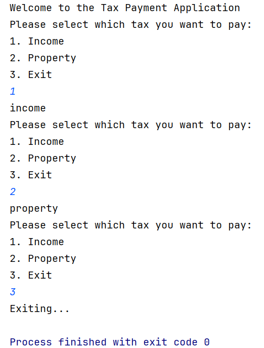
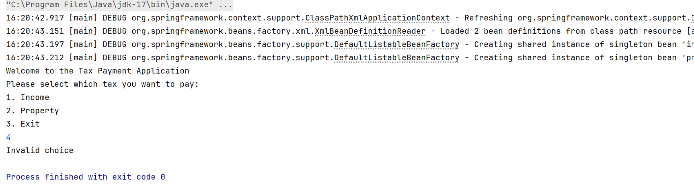

## Problem statement

Continuing the tax application, you must prompt the user to select which type of tax he wants to pay and load up the corresponding bean from the application Context. Complete the logic in the given code template.

---

## 🧪 Tasks

1. You need to complete the user input for your tax application.

2. Based on the tax choice chosen by the user, complete the switch case thus updating the `taxChoice` variable.

   For example:

    - If user input is `1`, then `taxChoice` variable value will be IncomeTax bean id i.e. `"incomeTax"`.

3. At last, you need to use the `taxChoice` variable with `context.getBean()` method to fetch the bean based on the user's choice.

---

## ⚠️ Special Instructions for submitting the solution:

1. Remove the `target` folder from the root directory of your project.

2. Remove the `test` folder from your `src` folder.

---

## 📝 Note

1. Don't change the versions of Spring Boot (`3.0.0`) and Java (`17`). If needed then install the same.

2. Do not move the `ApplicationContext` file.

3. Bean ID should be the same as the class name but in **camel-case** version (refer to `applicationContext` file).

4. Do not modify the template code as it may produce inaccurate results. Keeping the original code intact is crucial to ensure correct output.

---

## 💡 Sample output

> Please note that the output below is not the final application result, but is intended to help the learner understand this part.

> 
