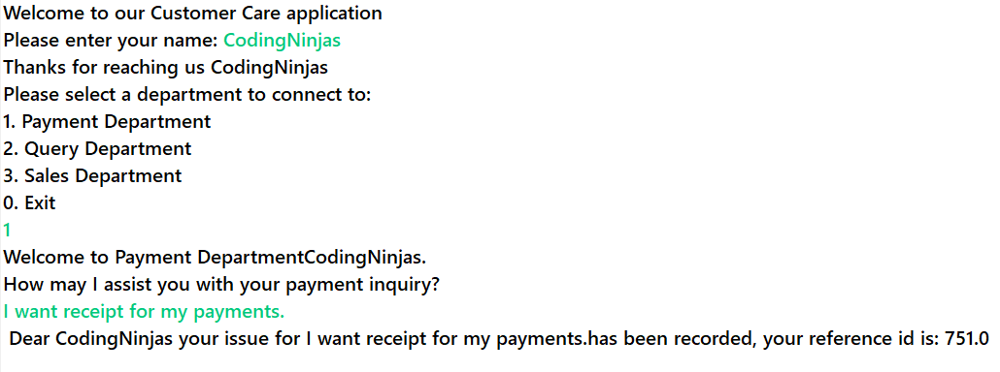

## Problem Statement

Suppose you are working on a project for a company that sells electronic gadgets. The company's customer care department handles customer queries, payments, and sales-related issues. The developer has created an interface named `CustomerCare` and three classes implementing it: `PaymentDepartment`, `SalesDepartment` and `QueryDepartment`. He needs your assistance to complete the project. You have to implement the interface methods in all three given classes.

You will also need to complete the XML file to configure the beans and use `ClassPathXmlApplicationContext` to manage the beans. The file is located in `src/main/resources`.

---

## 📘 CustomerCare Interface Details

- `getDepartment()`:  
  This method returns the name of the Department selected by the user.

- `getService()`:  
  This method returns the prompt to welcome the user with the given name, and department selected, and ask for the issue.  
  e.g. `"Welcome John, you have reached the payments department"`.

- `setCustomerName(String name)`:  
  This method sets the name of the user from the console.

- `setProblem(String problem)`:  
  This method sets the issue for the department given by the user.  
  e.g. `"I have an issue with my receipt"`.

- `getProblem()`:  
  This method returns the custom response to the user based on the name and the selected department.  
  e.g. `"Dear John, your issue is registered with Payments"`.

---

## ✅ Tasks

1. Implement the interface methods in the given classes.

2. Create an XML file to configure the beans. Define three beans for the `PaymentDepartment`, `SalesDepartment`, and `QueryDepartment` classes.

3. Use `ClassPathXmlApplicationContext` to manage the beans.

4. Create a `Main` class with a `main()` method. In the `main()` method, get the required beans from the `ApplicationContext`.

5. Create a console application that takes in the user’s name, asks for the specific department, and records their inquiry.

6. Test your implementation by running the `Main` class.

---

## 📁 Special Instructions for Submitting the Solution

1. Remove the `target` folder from the root directory of your project.

2. Remove the `test` folder from your `src` folder.

---

## ⚠️ Note

1. Don't change the versions of Spring Boot (`3.0.0`) and Java (`17`). If needed, then install the same.

2. Do not move the `ApplicationContext` file.

3. Bean ID should be the same as the class name but in **camel-case** version (refer to `ApplicationContext` file).

4. Do not modify the template code as it may produce inaccurate results. Keeping the original code intact is crucial to ensure correct output.

---

## 🖥️ Sample Output

