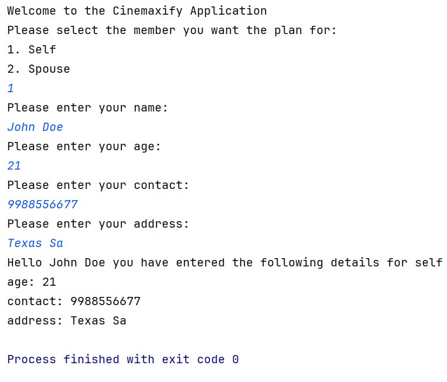

# 🎬 Cinemaxify OTT Platform – Spring Boot DI Application

## Problem Statement

A developer is building an OTT platform called **"Cinemaxify"** using Spring Boot's dependency injection.

The application allows users to select either **Self** or **Spouse** members for plan purchase, followed by their choice between **NormalPlan** or **PremiumPlan** subscriptions.

---

## ✅ Tasks

1. The `User` interface has the following methods:

   a. `void setUserDetails(String name, int age, Long contact, String address)`  
   This method sets the user's name, age, contact, and address based on the provided parameters.

   b. `void getUserDetails()`  
   This method prints the user's details, including their name, member type, age, contact, and address.

2. Complete the `Self` class by adding the below-mentioned attributes and methods:

    - `name` (String)
    - `age` (int)
    - `contact` (Long)
    - `address` (String)
    - Implement the `User` interface in the `Self` class and override the methods.

3. Complete the `Spouse` class by adding the below-mentioned attributes and methods:

    - `name` (String)
    - `age` (int)
    - `contact` (Long)
    - `address` (String)
    - Implement the `User` interface in the `Spouse` class and override the methods.

4. Create the **beans** for `User` implementations in the `applicationContext.xml` file as described in the template.

5. In the `main()` method, load context from the `applicationContext.xml` file which is located in `src/main/resources`.

6. Create a console application that selects the user and saves details for the selected user as shown in the output below.

7. Test your implementation by running the `Main` class.

---

## 📁 Special Instructions for Submitting the Solution

1. Remove the `target` folder from the root directory of your project.

2. Remove the `test` folder from your `src` folder.

---

## ⚠️ Note

1. **Don't change** the versions of Spring Boot (`3.0.0`) and Java (`17`). If needed, then install the same.

2. Do not move the `ApplicationContext` file.

3. Bean ID should be the same as the class name but in **camel-case** version (refer to `applicationContext` file).

4. Do **not modify** the template code as it may produce inaccurate results. Keeping the original code intact is crucial to ensure correct output.

---

## 🖥️ Sample Output

