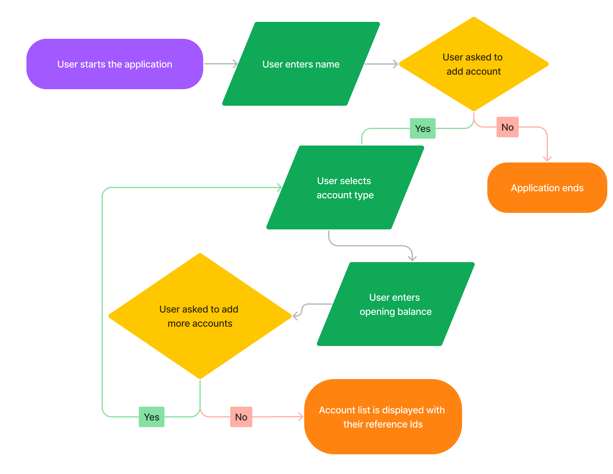
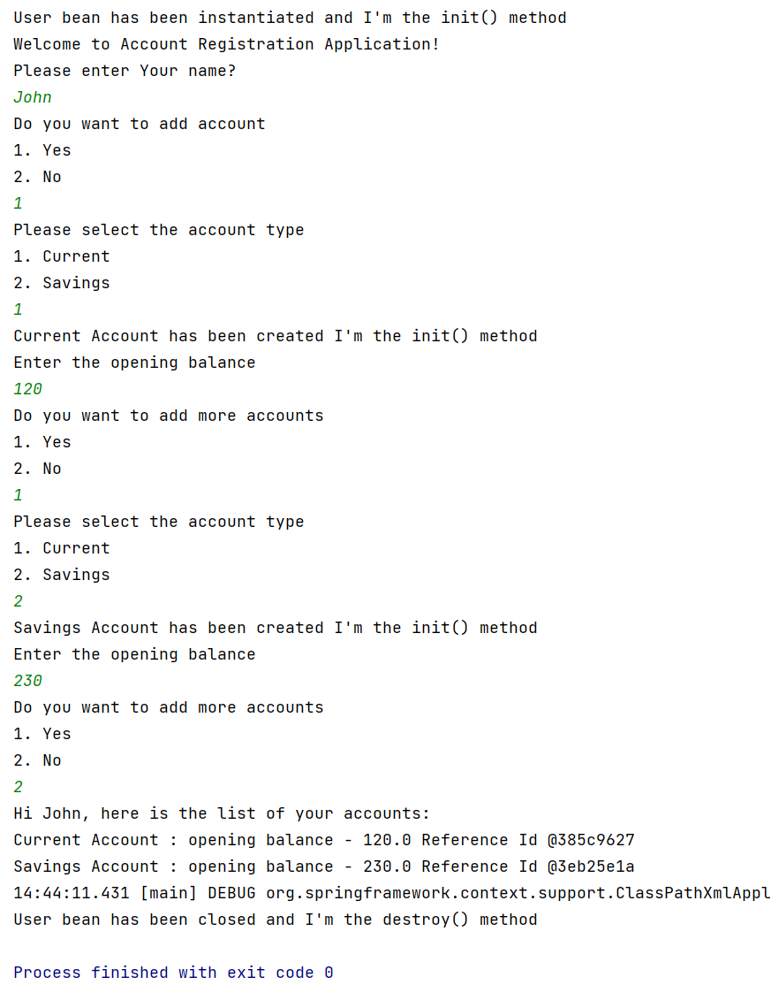

## Problem Statement

In continuation of the Bank Account Registration application, now you have to take context using SpringApplication.run. Complete the application accordingly.

- You are supposed to use the camel-case naming convention for writing the bean name inside the @Component Annotation where required.

**Example:** 
I have a class with the name savingsAccount, and the bean name for it will be "savingsAccount".
---
## Flow Chart

---

## Sample Output
